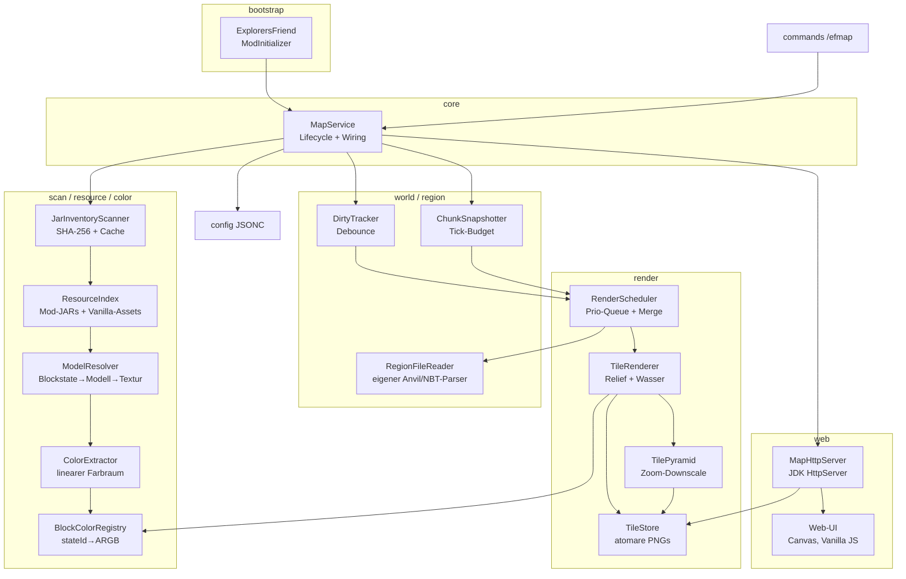
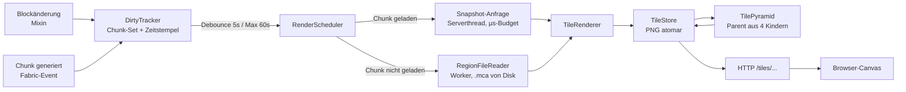
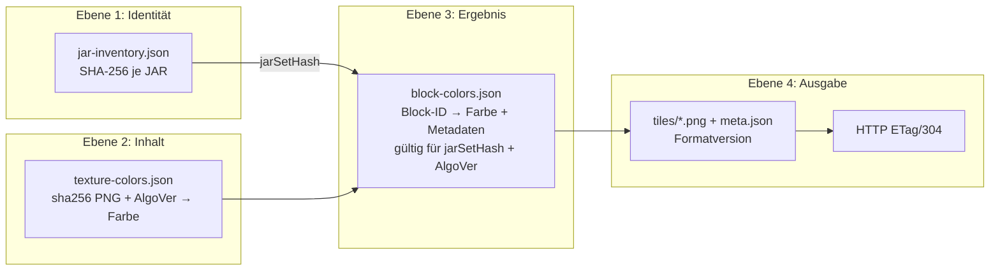
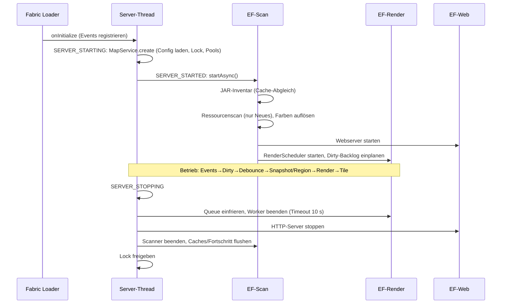

# Phase C – Architektur

Einzelmodul-Gradle-Projekt (bewusst gegen Überarchitektur entschieden); Trennung erfolgt
über Pakete mit klaren Abhängigkeitsrichtungen. Reine Logik (testbar ohne Minecraft) ist
strikt von dünnen Minecraft-Adaptern getrennt.

## Komponenten

## Datenfluss

## Threading-Modell

| Thread/Pool | Anzahl (Default) | Aufgaben | Blockierend erlaubt? |
| --- | --- | --- | --- |
| Server-Thread | – | Event-Marking (O(1)), Chunk-Snapshots unter µs-Budget, Command-Feedback | **nein** (hartes Budget) |
| `EF-Scan-#` | 2 | JAR-Hashing, Ressourcen-/Texturscan, Farbberechnung, Cache-IO | ja |
| `EF-Render-#` | 2 | Kachelrendern, PNG-Encode/IO, Zoompyramide, Regionsdatei-Parsing | ja |
| `EF-Sched` | 1 | Debounce-Timer, Fortschritts-Logs, Watchdog, Spieler-Snapshot | kurz |
| `EF-Web-#` | 2 | HTTP-Requests | ja (mit Timeouts) |

Regeln: Weltdaten werden **ausschließlich** auf dem Serverthread gelesen (Snapshots) oder
aus gespeicherten Dateien (Regionsreader). Worker sehen nur immutable Snapshots/Arrays.
Alle Pools sind benannt, daemonisiert, bounded und werden beim Shutdown geordnet beendet.
Kein globaler ForkJoinPool.

## Cachemodell

## Lifecycle

## Rendering-Pipeline (eine Kachel)

1. Eingabe: `TileSnapshot` — je Spalte (512×512 bzw. 16×16 pro Chunk): Oberflächenhöhe,
   oberster sichtbarer Blockzustand, Wassertiefe, Biom.
2. Farbe: `BlockColorRegistry` (stateId→ARGB, O(1)-Arrayzugriff), Tint (Gras/Laub/Wasser)
   per Biome-Colormap, manuelle Overrides bereits eingerechnet.
3. Schattierung: Relief aus Höhendifferenz zu West-/Nordnachbar; Wassertiefe dunkelt ab;
   transparente Blöcke werden über den darunterliegenden Untergrund geblendet.
4. PNG-Encode (ImageIO) → `TileStore.writeAtomic` → Parent-Kachel-Job (Merge) in Queue.
5. Fehler: Exception isoliert die Kachel (Retry ≤ 3), niemals die Queue.

## Webarchitektur

- JDK `HttpServer`, fester kleiner Threadpool, Verbindungslimit per Semaphore,
  Idle-Timeouts über `HttpServer`-Konfiguration + manuelle Request-Deadline.
- Routen: `/` + statische UI (nur eingebetteter Classpath, Whitelist), `/tiles/{dim}/{z}/{x}_{y}.png`
  (Regex-validiert, ETag aus mtime+Größe, `Cache-Control: no-cache` ⇒ 304-Revalidierung),
  `/api/status`, `/api/worlds`, `/api/players` (gzip, `no-store` für Spieler).
- Kein Zugriff auf Live-Serverzustand aus HTTP-Threads: Spielerliste wird vom
  `EF-Sched`-Thread periodisch auf dem Serverthread gesampelt und als immutabler
  JSON-Snapshot publiziert.

## Fehlerstrategie

| Fehler | Behandlung |
| --- | --- |
| Defektes JAR/PNG/JSON, Zyklen, fehlende Parents | Ressource überspringen, Fallbackfarbe, gebündeltes WARN, Scan läuft weiter |
| ZIP-Bomb-Indikatoren (Entries/Größe/Kante) | Datei überspringen + WARN |
| Kachel-Renderfehler | Retry ≤ 3, Dirty bleibt, Queue läuft weiter |
| Cache korrupt | Quarantäne `*.corrupt-N`, Neuaufbau |
| Port belegt / Bind-Fehler | Karte deaktiviert, Server läuft weiter (ERROR-Log) |
| Voller Datenträger | atomare Writes verhindern Teilzustände; Fehler gebündelt geloggt |
| Worker-Crash | Uncaught-Handler loggt; Watchdog erkennt hängende Jobs (Timeout) |
| Zweiter Serverstart auf denselben Daten | Lock verhindert Schreibkonflikte (Read-Only-Modus) |

## Shutdown-Reihenfolge

1. Dirty-/Progress-Zustand persistieren (best effort, atomar)
2. Scheduler-Thread stoppen (keine neuen Jobs)
3. Render-Queue einfrieren; Worker `shutdown()` → `awaitTermination(10 s)` → `shutdownNow()`
4. HTTP-Server `stop(1 s)`
5. Scan-Pool beenden; Caches flushen
6. Datei-Lock freigeben

Reihenfolge stellt sicher: keine neuen Aufträge nach Persistenzbeginn, keine
halbgeschriebenen Kacheln (atomare Writes), JVM-Exit nie durch Non-Daemon-Threads blockiert.
